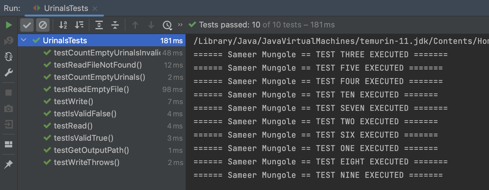

# ICA-8 Testing (individual)

Using GitHub, Java and JUnit 5 (Jupiter), create a Test Driven Development (TDD) program for counting urinals.

## How To

### Test

1. Open the project using IntelliJ IDEA code editor
2. Navigate to **UrinalsTests.java** file
3. In the top right corner, besides the `run` button, select **UrinalsTests** as *Run Configuration*
4. Click on the `run` button to execute all the test cases.

#### Test Cases Output



### Run

1. Open the project using IntelliJ IDEA code editor
2. Navigate to **Urinals.java** file
3. In the top right corner, besides the `run` button, select **Current File** as *Run Configuration*
4. Click on the `run` button to execute the `main` method.

#### Output


### Environment

- JavaSE-11
- junit-platform-console-standalone-1.9.1.jar
- IntelliJ IDEA 2022.2.3 (Community Edition)

## Problem Statement

In men's public toilets with urinals, there is this unwritten rule that you leave at least one urinal free between you and the next person peeing. For example if there are 3 urinals and one person is already peeing in the left one, you will choose the urinal on the right and not the one in the middle. That means that a maximum of 3 people can pee at the same time on public toilets with 5 urinals when following this rule (Only 2 if the first person pees into urinal 2 or 4).


### Task

You need to write a function that returns the maximum of free urinals as an integer according to the unwritten rule.

### Examples

- `10001` returns `1` (10101)
- `1001` returns `0` (1001)
- `00000` returns `3` (10101)
- `0000` returns `2` (1001)
- `01000` returns `1` (01010 or 01001)

### Input

A String containing 1s and 0s (Example: 10001) (1 <= Length <= 20). This string can come from the keyboard, or a file called `urinal.dat`. The program will continue processing until a `-1` or `<eof>` is reached. (This means you handle unusual input without crashing.)

> **Note:** A one stands for a taken urinal and a zero for a free one.

### Output

If input is the keyboard, print the results to the screen. If input is from a file, output to `rule.txt`. If the file rule.txt already exists, increment a counter and rename the file using the following rule pattern: `rule1.txt`, `rule2.txt`, etc. The output is **JUST THE NUMBER** of free urinals. Given the above output, your `rule.txt` file should contain:

``` txt
1
0
3
2
1
```

#### NOTE

When there is already a mistake in the input string (for example `011`), then return `-1`

What are your equivalency tests? Are my examples enough?

Have fun and don't pee into the wrong urinal!
